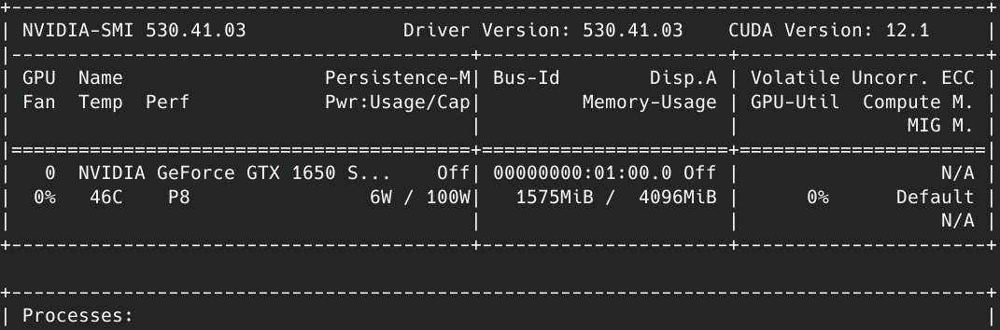
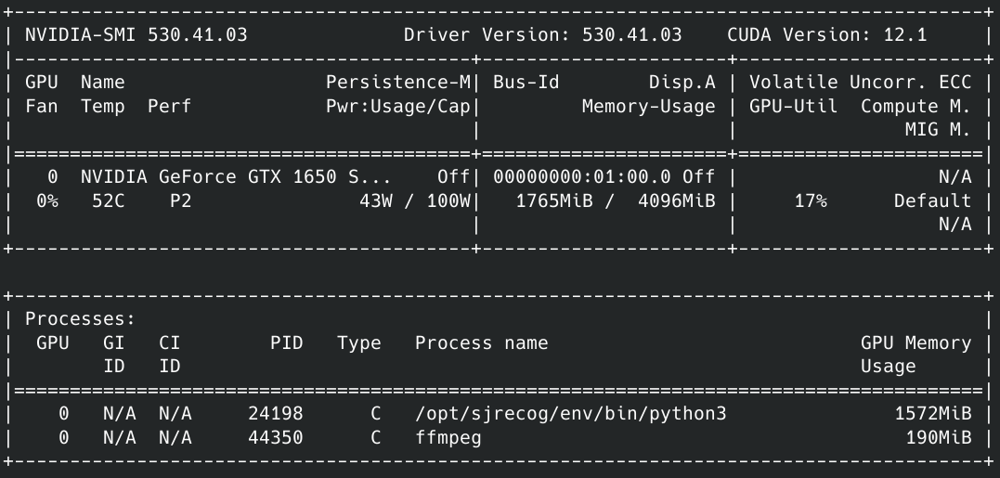

# ffmpeg-nvidia
Encode Motion videos with ffmpeg and NVIDIA hardware acceleration

## Introduction

My use case is unique, but it illustrates how open source software can be used to create custom solutions.

I'm running [Motion](https://motion-project.github.io/index.html) v4.5.1 on a [Debian](https://www.debian.org/) 11 (Bullseye) server with a handful of PoE network cameras. I've been running Motion for at least 5 years and can't say enough good things about it. These instructions may apply to other platforms, but I can't guarantee it.

One of my security cameras generates 1920 x 1280 @ 30FPS footage as an MJPEG stream. Motion processes this output and triggers an event when changes are detected. This process caused my otherwise capable server (Xeon 3.8GHz 6 core, 64GB RAM, SSD, Ubuntu 20.04 then Debian 11.0) some grief. I could always tell when an event occurred because my CPU fan would scream to 4000 RPM then decelerate once temps were normal again. Due to form factor constraints, I can only run a low profile (Noctua L9i) cooler. Noise or thermal throttling are my options :E

## Getting Started

### Avoid the Debian drivers

Don't install the .deb files that are provided by Debian for Bullseye. This applies to the graphics driver and Cuda toolkit.

Avoid the Cuda toolkit .deb that is provided by NVIDIA. I suspect that this was actually intended for Ubuntu, as it doesn't work with Debian. I ran into some weird issues where it either didn't do anything, partially installed the Cuda 12.1 libraries, caused some library collision errors, and (finally) wouldn't uninstall cleanly and broke my apt. I did a fresh installation of Debian to resolve that.

As of 4/1/2023, you will need:
* Nvidia graphics driver v5.30+ for Cuda 12 and the toolkit
* Cuda 12 to make use of h264_nvenc

I didn't find a solution that would enable graphics driver v4.70 and Cuda 11 to work with h264_nvenc, or I would've stayed with the stable driver.

I installed this on a headless machine, so I didn't encounter any issues with X compatibility. YMMV!

### Why compile?

None of the non-free features are included with ffmpeg binaries. If you want to use your NVIDIA GPU you'll need to compile your own ffmpeg, or use someone else's binaries. 

Let's get started!

### Set up your /etc/apt/sources.list

Add `contrib` and `non-free` to your repos

```
# Debian 11 "Bullseye"
deb http://deb.debian.org/debian/ bullseye main contrib non-free
```

Run `sudo apt update`

### Install initial Debian packages

I uncheck the "Standard Linux utilities" option when installing Debian as I prefer to select the applications myself

```
sudo apt install acl bash-completion binutils bc build-essential curl dnsutils firmware-misc-nonfree htop hwdata lm-sensors man-db ncat nmap nfs-kernel-server nut-client python3-pip python3-venv sudo systemd-timesyncd tmux traceroute tree unrar unzip vim wget
```

### Install Debian packages for NVIDIA graphics driver

```
sudo apt install linux-headers-$(uname -r) gcc make acpid dkms libglvnd-core-dev libglvnd0 libglvnd-dev dracut
```
### Download (but don't install yet)

* NVIDIA Graphics Driver: https://www.nvidia.com/download/index.aspx (select Download Type -> "New Feature branch" for v5.30+)
* NVIDIA Cuda Toolkit (pick runfile): https://developer.nvidia.com/cuda-downloads

### Disable Nouveau modules

I simply blacklisted Nouveau in /etc/modprobe.d/. You can also have the NVIDIA driver runfile do this for you. 

## Install the Cuda toolkit 

1. Install the NVIDIA graphics driver runfile first. It will probably be more current than what's included with the Cuda toolkit. The NVIDIA graphics driver version number doesn't have to match what's included with the CUDA toolkit, but it **must** be v5.30+
2. Restart, confirm that nvidia-smi returns something useful like

Note the graphics driver and Cuda versions
3. Install the Cuda toolkit run file. Opt out of installing the NVIDIA graphics driver that's included with Cuda since you already installed a more current version. 
    1. Optional: Opt out of any X utilities, examples, documentation, etc. in the Cuda installer
    2. Follow the instructions that are displayed on completion:
    ```
    Make sure that
     -   PATH includes /usr/local/cuda-12.1/bin
     -   LD_LIBRARY_PATH includes /usr/local/cuda-12.1/lib64, or, add /usr/local/cuda-12.1/lib64 to /etc/ld.so.conf and run ldconfig as root
    ```
    3. Your PATH (in ~/.profile) should be similar to: `PATH="/usr/local/cuda-12.1/bin:$PATH"`

Restart your system!
 
## Compile ffmpeg

### Install dependencies 

Install packages as outlined by this guide: https://trac.ffmpeg.org/wiki/CompilationGuide/Ubuntu#GettheDependencies

I also included nasm, libx264, and libx265

Also see https://trac.ffmpeg.org/wiki/HWAccelIntro#NVENC

Note: This page cites "compiling FFmpeg with `--enable-cuda-llvm`" as a requirement, however `--enable-cuda-nvcc` supersedes this 

### Install nv-codec-headers

```
mkdir -p ~/nvidia
cd ~/nvidia
git clone https://git.videolan.org/git/ffmpeg/nv-codec-headers.git
cd nv-codec-headers
make PREFIX=/usr
sudo make install PREFIX=/usr # Yes, specify PREFIX twice
```

### Get ffmpeg source

I used 5.1.3 and downloaded the release from https://ffmpeg.org/download.html

```
cd ~/nvidia
tar xvJf ffmpeg-5.1.3.tar.xz
cd ffmpeg-5.1.3
```

### Configure, make, and install ffmpeg

The `extra-cflags` and `extra-ldflags` correspond to the directory where you installed the Cuda toolkit (/usr/local is the default)

```
./configure --enable-nonfree --enable-gpl --enable-gnutls --enable-cuda-nvcc --enable-libnpp --enable-ffnvcodec --enable-libx264 --enable-libx265 --extra-cflags=-I/usr/local/cuda/include --extra-ldflags=-L/usr/local/cuda/lib64
```

Then

```
make -j $(nproc) # Use all available processor cores
sudo make install
```

## Set up ffmpeg for Motion

I referred to this [excellent post](https://superuser.com/a/1296511) for an overview of ffmpeg h264_nvenc settings 

Be sure to pay attention to the target bitrate (`-b:v`), maximum bitrate (`-maxrate`) and buffer size (`-bufsize`). See [this page](https://trac.ffmpeg.org/wiki/Limiting%20the%20output%20bitrate) for more information on what these parameters do.

Getting the parameters right can be challenging. I recommend testing them out as follows:

**Note 1:** This assumes that you have a fully functional Motion configuration. If you don't, see the Motion Project [documentation](https://motion-project.github.io/motion_config.html)

**Note 2:** If ffmpeg throws an error, you'll get a bunch of "broken pipe" messages in your motion.log (depending on your log level settings).
```
event_extpipe_put: Error writing in pipe , state error 1: Broken pipe
```
Performing the steps below will save a _**lot**_ of time versus testing Motion live. 

**Note 3:** Once everything is working, you may see an occasional error of:
```
event_extpipe_put: pipe ffmpeg -y -f ... <filepath> not created or closed already
```
This is a [known issue](https://github.com/Motion-Project/motion/issues/1659) with Motion and won't impact actual functionality

1. From the /etc/motion configuration directory, set aside a camera configuration for testing purposes. Load it in /etc/motion/motion.conf
2. Use the following settings to dump Motion's video output to a file
```
movie_output off

movie_extpipe_use on
movie_extpipe cat > /tmp/stream 
```
3. Trigger an event in Motion and verify that /tmp/stream contains binary data.
4. Follow the ffmpeg example provided by Motion: https://motion-project.github.io/motion_config.html#movie_extpipe
```
movie_extpipe ffmpeg -y -f rawvideo -pix_fmt yuv420p -video_size %wx%h -framerate %fps -i pipe:0 -vcodec libx264 -preset ultrafast -f mp4 %f.mp4
```
5. Since the stream is a slice of video data, it doesn't contain an identifying header that ffmpeg can readily use to identify its content. We need to tell ffmpeg what it's working with (steps i-v are for this purpose). I recommend switching to the /tmp directory and testing your ffmpeg commands there to catch and resolve error messages.
    1. `-y` # overwrites output files without a prompt
    2. `-f rawvideo`
    3. `-pix_fmt yuv420p`
    4. `-video_size %wx%h` # fields auto filled by Motion, defined in motion camera config file. Substitute with your video dimensions (ex. 1280x960).
    5. `framerate %fps` # field auto filled by Motion. Substitute with your video's FPS (ex. 12)
    6. `-i /tmp/stream` # will be replaced with `-i pipe:0` in Motion
    7. The rest of the fields pertain to the output format

Once you've identified an ffmpeg command that works and successfully encodes the stream file, remove `movie_extpipe cat > /tmp/stream` from your Motion config and add your own with the format (`%`) values.

The `movie_extpipe` command that I used is:
```
movie_extpipe ffmpeg -y -f rawvideo -pix_fmt yuv420p -video_size %wx%h -framerate %fps -hwaccel cuda -i pipe:0 -c:v h264_nvenc -b:v 2.5M -maxrate 2.5M -bufsize 1.75M -preset p7 -fps_mode vfr -tune hq %f.mp4
```

### Results

I didn't have time to run tests and generate scientific results, but here are my observations after initial testing

1. Video sizes are between 1/3 to 1/2 of original size (!)
2. Videos retained nearly identical quality to Motion's built in ffmpeg output and are generated more quickly
3. No discernible loss of quality
4. Lower server load and fewer temperature spikes during events

If everything works as expected, nvidia-smi should display ffmpeg process activity during encoding

